{.ifr_center}

The interactive Dash web dashboard provides a browser-based interface for exploring processed experimental data from the freely-walking optomotor experiments. It is built with [Plotly Dash](https://dash.plotly.com/) and [Dash Bootstrap Components](https://dash-bootstrap-components.opensource.faculty.ai/).

## What the dashboard shows

The dashboard allows you to:

- Select a **protocol results directory** and browse all strains and conditions within it
- View **timeseries plots** of behavioural metrics (forward velocity, angular velocity, turning rate, distance from centre, distance delta) for any strain vs. the empty-split control
- Compare responses across conditions in an interactive subplot layout
- Switch between metrics, strains, and conditions using sidebar controls
- View **cohort-level statistics** (number of vials, number of flies per strain)

## Prerequisites

The dashboard requires:

- The [freely-walking-optomotor](https://github.com/leburnett/freely-walking-optomotor) repository cloned locally
- The **pixi** package manager installed ([pixi.sh](https://pixi.sh))
- Processed result `.mat` files from `process_freely_walking_data` (see [Analysis](freely_walking_analysis.qmd))

## How to start the dashboard

### Option 1: Shell alias (recommended)

Set up the `dash-freely` alias by adding this line to `~/.zshrc` (or `~/.bashrc`):

```bash
alias dash-freely='~/Documents/GitHub/freely-walking-optomotor/dashboard.sh'
```

Then from anywhere in the terminal:

```bash
dash-freely              # start the dashboard (opens http://localhost:8050)
dash-freely preprocess   # preprocess .mat files to Parquet first
```

### Option 2: Run directly with pixi

```bash
cd python/freely-walking-python
pixi run preprocess    # convert .mat files to Parquet (required on first use or after new data)
pixi run dashboard     # start the Dash app on http://localhost:8050
```

The dashboard will open automatically in your default browser once the server is ready.

## Preprocessing

Before using the dashboard for the first time (or after new data has been processed), you need to convert the MATLAB `.mat` result files to Parquet format for fast loading:

```bash
dash-freely preprocess
# or: cd python/freely-walking-python && pixi run preprocess
```

This reads all `*_data.mat` files from the results directory and writes Parquet files to a `_preprocessed` subdirectory alongside the original data. The preprocessing step only needs to be repeated when new experiment data has been processed.

## How the dashboard works

The dashboard is built from several modules in `python/freely-walking-python/dashboard/`:

| Module | Purpose |
|:-------|:--------|
| `app.py` | Main Dash application layout (sidebar, content area, controls) |
| `callbacks.py` | Interactive callback functions that update plots when selections change |
| `data_loader.py` | `DataStore` class that loads Parquet data and provides strain/condition lookups |
| `preprocess.py` | Converts `.mat` result files to Parquet format |
| `processing.py` | Data processing utilities for the dashboard |
| `cohort_stats.py` | Computes per-strain cohort and fly count statistics |
| `heatmap.py` | Heatmap visualisation components |
| `constants.py` | Shared constants (metric names, condition labels, default paths) |

On startup, the dashboard pre-loads all strain data into memory for fast interactive use. This means startup takes approximately 20–30 seconds, but subsequent interactions are near-instant.

## Using the dashboard

1. **Set the data directory** — The sidebar shows a text input for the path to the protocol results folder (e.g. the `protocol_27` results directory). The default path is read from the configuration.
2. **Select a strain** — Choose from the dropdown list of available strains.
3. **Select a metric** — Choose the behavioural metric to plot (forward velocity, angular velocity, turning rate, distance from centre, or distance delta).
4. **Browse conditions** — The main panel displays timeseries subplots for each condition, showing the selected strain against the empty-split control with mean and SEM shading.

#### Metadata and navigation

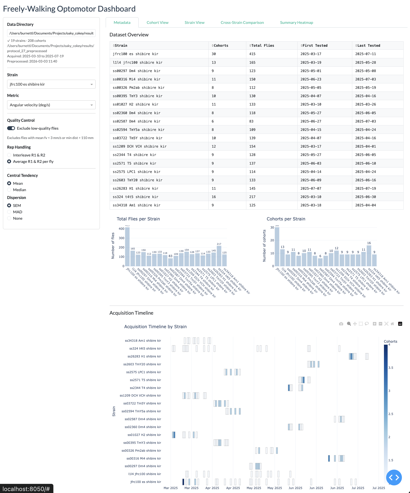{.ifr_center}

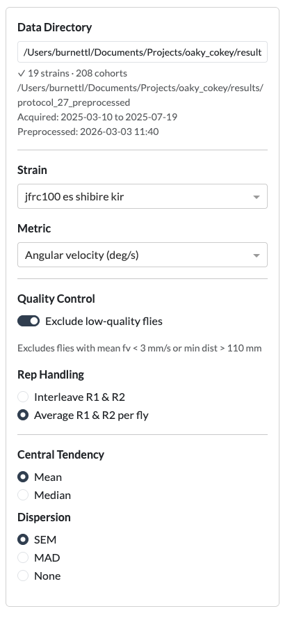{.ifr_center width=40%}

#### Cohort View

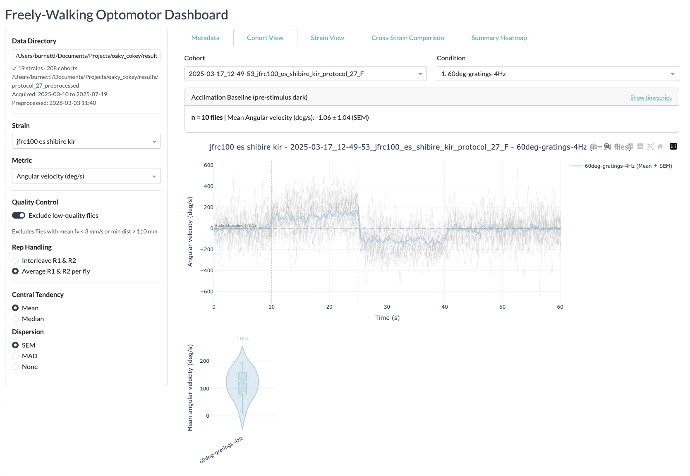{.ifr_center}

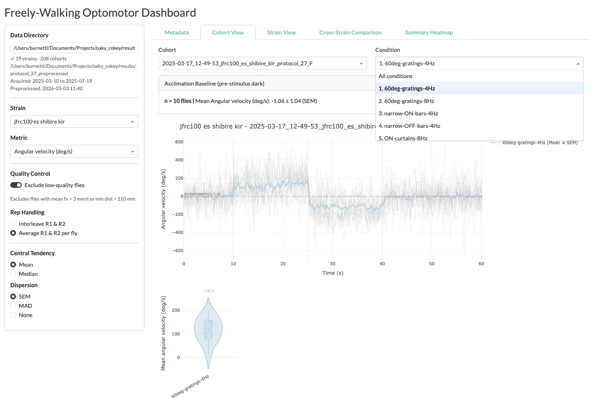{.ifr_center}

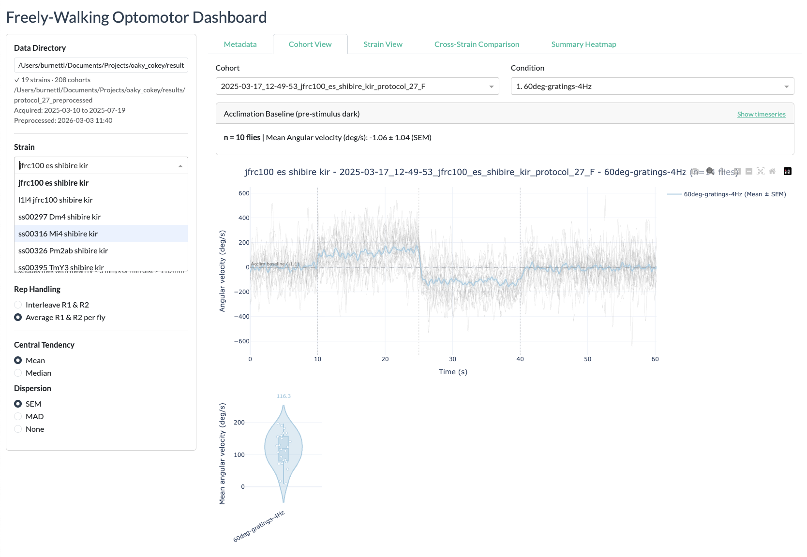{.ifr_center}

#### Strain view

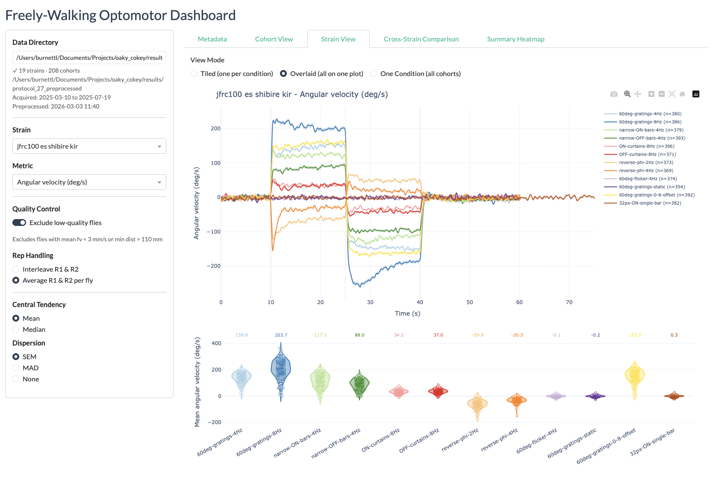{.ifr_center}

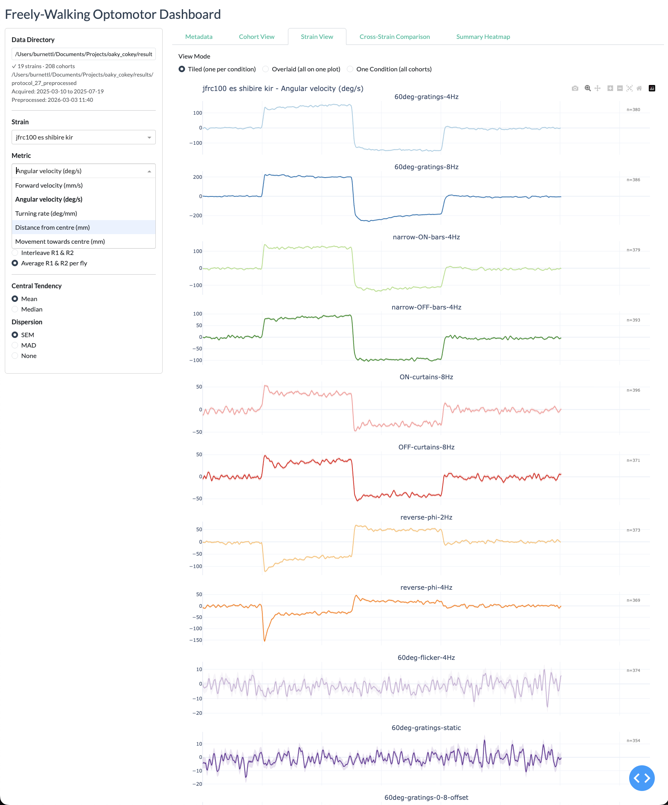{.ifr_center}

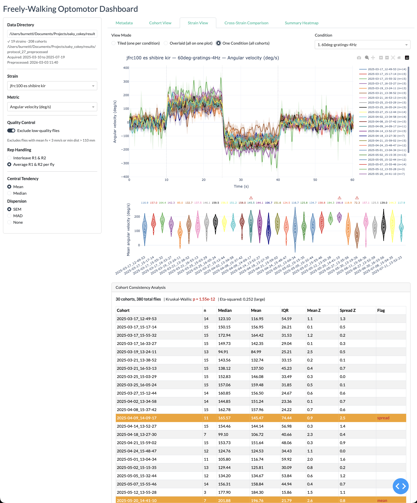{.ifr_center}

#### Cross-strain view

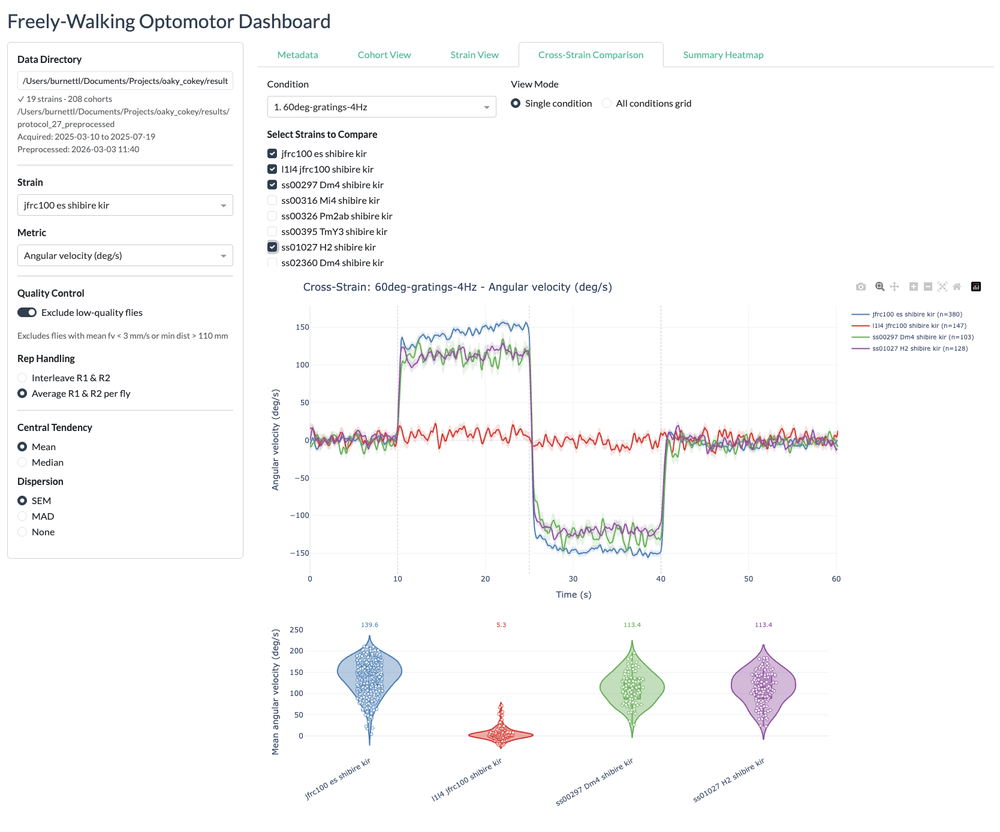{.ifr_center}

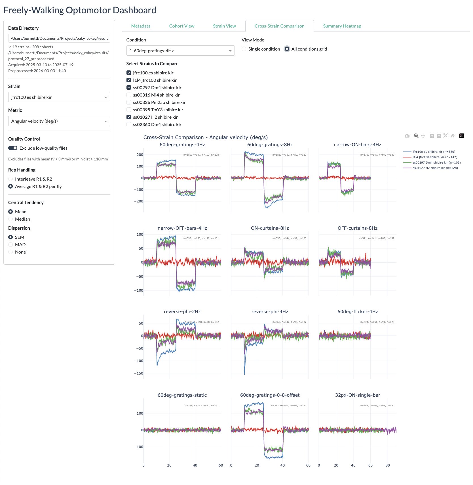{.ifr_center}

#### Summary heatmaps

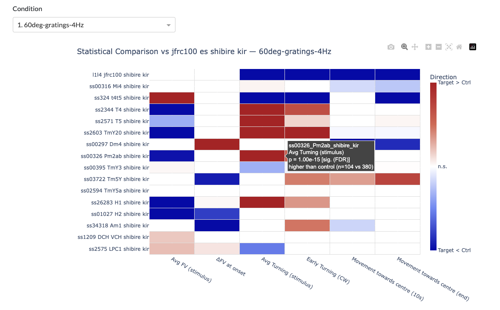{.ifr_center}

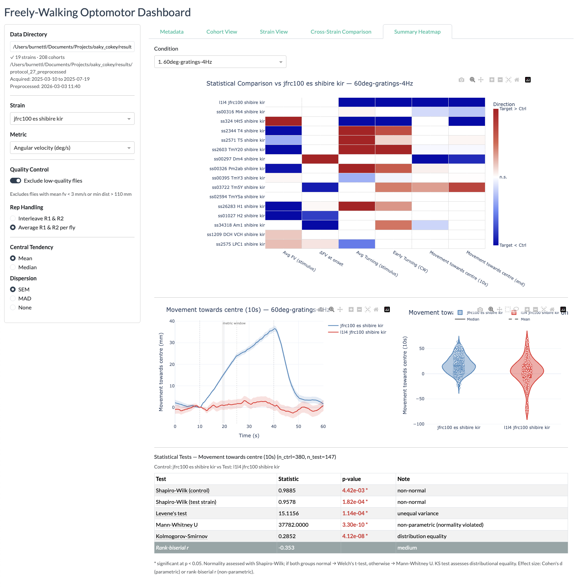{.ifr_center}
