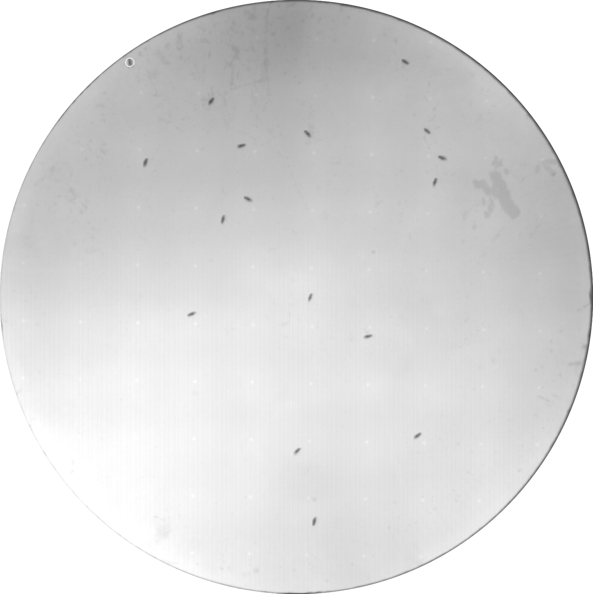

Welcome to the documentation for the freely-walking optomotor experiments conducted in the Reiser Lab. This section covers everything you need to know to run, process, and analyse experiments using the G3 LED arena.

{.ifr_center width=60%}

## Background

The **Freely Walking Course Control Mechanisms** screen was conducted in **2025** using the G3 LED arena in the Reiser Lab at HHMI's Janelia Research Campus. 

The screen measures optomotor responses, motion-induced centring behaviour, and general locomotion metrics in freely-walking *Drosophila*. Flies are presented with moving visual stimuli (gratings, bars, flicker, curtains, reverse-phi) while their trajectories are tracked at 30 fps.

The experiment protocol was designed by Laura Burnett and experiments were conducted by Laura Burnett and **Aparna Dev** from PTR. All fly husbandry was carried out by **Edward Rogers**.

## Section guide

| Page | Description |
|:-----|:------------|
| [Quickstart](freely_walking_quickstart.qmd) | Step-by-step instructions for running, creating, and analysing experiments — start here if you are new |
| [Rig Specs](freely-walking-rig-specs.qmd) | Hardware and software requirements for the G3 LED arena setup |
| [Pipeline](freely_walking_pipeline.qmd) | Experiment workflow, the automated processing pipeline, and the pipeline status page |
| [Data Organisation](freely_walking_data.qmd) | How raw, tracked, and processed data is structured and where it is stored |
| **Protocols** | |
| [Protocols Overview](freely_walking_protocols_index.qmd) | Full list of experimental protocols with timing, conditions, and lineage |
| [Experiment Logging](freely_walking_logging_system.qmd) | How experiment metadata is logged to Google Sheets |
| **Patterns** | |
| [Patterns Overview](freely_walking_patterns_index.qmd) | Catalogue of all LED pattern files with previews and parameters |
| **Analysis** | |
| [Analysis](freely_walking_analysis.qmd) | The three-level data processing and analysis pipeline |
| [Analysing a New Protocol](freely-walking-analysis-new-protocol.qmd) | Guide to analysing data from protocols other than the main screen protocol |
| [Visualisation](freely_walking_visualisation.qmd) | Generating per-condition stimulus videos with fly trajectories |
| [Recording Observations](freely_walking_observations.qmd) | Manual behavioural scoring using the review GUI |
| [Dashboard](freely_walking_dashboard.qmd) | Interactive Dash web dashboard for exploring processed data |
| **Reference** | |
| [Configuration & Paths](freely_walking_configuration.qmd) | Three-computer setup, path configuration, and automation scripts |
| [Troubleshooting](freely_walking_troubleshooting.qmd) | Common issues and solutions organised by category |

## Code availability

The code for generating and running these protocols, processing and plotting the data, generating the documentation and the interactive dashboard is publicly available at [github.com/leburnett/freely-walking-optomotor](https://github.com/leburnett/freely-walking-optomotor).

## Data availability

Experiment data is saved directly on the `acquisition computer` after running an experiment.

This data is then copied to the `prfs group drive` and copied locally onto the `processing computer` to be processed. 

The results of the processing and analysis are saved on the `analysis computer` and backed up to the `prfs group drive`. 

See [Configuration & Paths](freely_walking_configuration.qmd) for details on the three-computer setup and path configuration.

See the [Data Organisation](freely_walking_data.qmd) page for details on the exact paths to where the data is stored and how it is structured.

## Key Resources

| Resource | Type | Description |
|:--------|:-------|:------------|
| [Dashboard](freely_walking_dashboard.qmd) | Visualiser | Interactive web dashboard for exploring processed data. Python app |
| [Trajectory viewer](freely_walking_trajectory_viewer.qmd) | Visualiser | Interactive html page for visualising trajectories |
| `Pipeline-status.html` page | Log | Status page for the automated processing pipeline (see [Pipeline](freely_walking_pipeline.qmd)) |
| [Google Sheets experiment log](https://docs.google.com/spreadsheets/d/1IsT3YndxAy3yN8o38r5RGK4dZsEdPXe0In4-OTEcXNw/edit?resourcekey=&gid=35583985#gid=35583985) | Log | Automatic log filled in after the completetion of successful experiments (see [Experiment Logging](freely_walking_logging_system.qmd)) |
| [Training Guide PDF](https://github.com/leburnett/freely-walking-optomotor/blob/main/docs/training_guide/_output/training_guide.pdf) | Documentation | Step-by-step guide for training new experimenters on the G3 LED arena setup |
| Reiser Lab LED Panel [documentation](https://reiserlab.github.io/Modular-LED-Display/Generation%203/Software/docs/g3_user-guide.html) | Documentation | Detailed documentation on the specifications of the G3 arena and how to design and run protocols |
